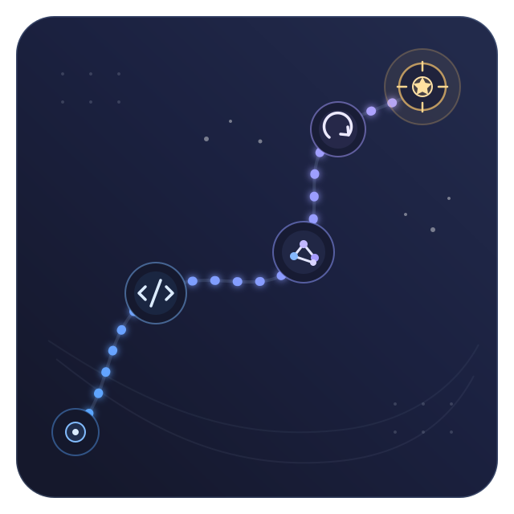

<!-- _paginate: skip -->
<!-- _footer: "" -->

# Your Path Into Tech

## Explore the Field, Build Real Skills, Take Your First Steps

Chris Ayers 
Principal Software Engineer | Speaker | Community Builder

<!--
Timing: 30 seconds.
Open by acknowledging that "getting into tech" can feel mysterious in high
school. Promise a practical map you can start on now, not a guaranteed shortcut.
The three verbs on this slide are the through-line for the entire talk.
-->

---

<!-- _class: invert -->

# Get the slides

Scan the code, or open:

## [chris-ayers.com/tech-career-toolkit](https://chris-ayers.com/tech-career-toolkit/)

Follow along now, and keep every link, tool, and resource from this talk.

<!--
Timing: 20 seconds.
A quick "scan to follow along" moment. Tell students they can grab the slides
now and revisit every link and resource afterward - no need to write anything
down.
-->

---

## Chris Ayers

### Principal Software Engineer Azure EngOps AzRel Microsoft

<i class="fa-brands fa-bluesky"></i> BlueSky: [@chris-ayers.com](https://bsky.app/profile/chris-ayers.com)
<i class="fa-brands fa-linkedin"></i> LinkedIn: [chris\-l\-ayers](https://linkedin.com/in/chris-l-ayers/)
<i class="fa fa-window-maximize"></i> Blog: [https://chris-ayers\.com/](https://chris-ayers.com/)
<i class="fa-brands fa-github"></i> GitHub: [Codebytes](https://github.com/codebytes)
<i class="fa-brands fa-mastodon"></i> Mastodon: [@Chrisayers@hachyderm.io](https://hachyderm.io/@Chrisayers)
~~<i class="fa-brands fa-twitter"></i> Twitter: @Chris_L_Ayers~~

---

# Start with the honest version

## No single route

Classes, clubs, online courses, camps, YouTube, or just teaching yourself - any
mix can get you started.

## First steps are experiments

A project or club is a way to try something, learn, and meet people. It is not a
forever decision.

## Start where you are

Time, money, and access are different for everyone. Pick a pace you can keep
alongside school.

> The goal is not to have it all figured out. The goal is to make your **next step doable**.

---

<!-- _class: columns invert -->

# 1 / Explore a direction, not all of "tech" <small>Pick one that sounds fun and one backup to explore.</small>

## Build and make

- Apps, games, and websites
- Testing and finding bugs
- Cybersecurity and ethical hacking
- Hardware, robotics, and IT

## Analyze and connect

- Data, AI, and machine learning
- Design and user experience (UX)
- Product: how apps get planned and made
- Explaining tech: writing, video, teaching

<!--
Timing: 60 seconds.
This is a section transition and a decision point. Stress that "software
engineering" is only one path. Ask students to notice which work sounds fun to
try this month, not which title sounds impressive. A backup keeps you flexible
without meaning "anything in tech."
-->

---

<!-- _class: directions -->

# Where do you want to go?

<i class="fa-solid fa-code"></i><strong>Development</strong>Write and ship software

<i class="fa-solid fa-vial"></i><strong>Testing</strong>Quality and automation

<i class="fa-solid fa-shield-halved"></i><strong>Security</strong>Protect systems and data

<i class="fa-solid fa-network-wired"></i><strong>Administration</strong>Systems, networks, and IT

<i class="fa-solid fa-robot"></i><strong>Data &amp; AI</strong>Insight, models, and ML

<i class="fa-solid fa-compass"></i><strong>Product</strong>Discovery and delivery

---

# You already have useful strengths

| Where it came from | Strengths you built | How it maps to tech |
|---|---|---|
| Games and hobbies | problem solving, patience | Debugging, learning systems |
| Clubs, sports, theater | teamwork, showing up | Collaborating, hitting deadlines |
| Class projects | research, explaining | Documenting, communicating clearly |
| A part-time job | responsibility, people skills | Reliability, knowing real users |

**Prompt:** **[something you did]** + **[where]** -> **[strength a tech project needs]**

<!--
Timing: 75 seconds.
Students often think they have "no experience." Reframe: the things they already
do build real strengths. A game speedrun is persistence and system learning; a
group project is collaboration and deadlines. Keep it specific and true, then
connect it to tech work.
-->

---

<!-- _class: columns invert -->

# 2 / Build real things <small>Small, finished projects are your proof.</small>

## Why build

- It turns learning into something real
- A finished project shows what you can do
- Building is the fastest way to actually learn

## What counts

- A game, a website, or a small script
- A robot part, a bot, or a mod
- Anything you can show and explain

<!--
Timing: 45 seconds.
This is the heart of the talk: you learn by making things. Stress that "project"
can be tiny and still count - a Scratch game, a one-page site, a robot subsystem.
The goal is small and finished, not big and unfinished, so you have something to
show and talk about later.
-->

---

# Build skills in a tight loop

## The loop

1. Pick **one area** that sounds fun
2. Learn just enough to start
3. Build a **small, finished** project
4. Show it and ask for feedback
5. Do it again, a little harder

## Guardrails

- Only learn what unblocks you
- Finish before adding features
- Keep it small enough to explain
- Jot down questions and decisions
- Shrink scope before adding hours

> Learning gets real when it becomes something someone can play, run, or look at.

<!--
Timing: 75 seconds.
Discourage endless tutorials and giant "someday" projects. "Finished" can be
tiny: a Scratch or MakeCode game, a one-page website, a small script, or a robot
subsystem. The next loop should add one new challenge, not restart from zero.
-->

---

# Learn the tools around the code

## Worth learning early

- The command line / terminal basics
- Your editor (like [VS Code](https://code.visualstudio.com/)) and a debugger
- [Git and GitHub](https://skills.github.com/): save and share code
- Reading errors and searching them well

## Practice by doing

- Automate one boring, repetitive task
- Break something on purpose, then fix it
- Guess what's wrong before you Google it
- Explain why you picked a tool

> Knowing the tools around the code makes projects way easier to finish.

<!--
Timing: 60 seconds.
Courses teach a language but skip the workflow around it. A little comfort with
the terminal, an editor, Git/GitHub, and reading errors makes projects easier to
finish - and gives great stories about debugging and fixing mistakes. AI tools
help here too, but they don't replace understanding.
-->

---

# A good project is easy to check out

## Explain it

- A README: what it is and who it's for
- Steps to run it that actually work
- What you chose and why
- What's not done yet, and your next step

## Show it

- A screenshot, GIF, or short demo video
- A link to try it (game, site, or repo)
- Sample input and output
- What part you built

**Match it to the area:** a game (playable link), data (a chart), a website (a
live link), hardware (a photo or video of it working).

<!--
Timing: 75 seconds.
Credibility comes from making a project easy to understand and try - not from how
big it is. A reviewer should get what it does, run or watch it, and see how you
think. Not every project needs everything: pick a demo, a screenshot, or a link
that fits what you built.
-->

---

# Free places to learn (really free)

## Start here

- [Experience CS](https://experience-cs.org/units) - CS units made for classrooms
- [freeCodeCamp](https://www.freecodecamp.org/) and [Foundational C#](https://www.freecodecamp.org/learn/foundational-c-sharp-with-microsoft/)
- [Microsoft Learn](https://learn.microsoft.com/training/) - guided paths and badges

- [GitHub Skills](https://skills.github.com/) - hands-on, guided courses
- [Scratch](https://scratch.mit.edu/) and [MakeCode Arcade](https://arcade.makecode.com/) - build games fast
- [Minecraft Education CS](https://education.minecraft.net/en-us/resources/computer-science)

<!--
Timing: 75 seconds.
There are excellent free, beginner-friendly places to learn - no paid course
required. Scratch and MakeCode make the first project fun; Experience CS,
freeCodeCamp, Microsoft Learn, and GitHub Skills go deeper. Point out that the
languages they use (Python, C#, JavaScript) are built in the open on GitHub.
-->

---

# AI is everywhere - learn to use it well

## Why it's a big deal

- It's in apps, search, art, and code
- Almost every field uses it now
- Using it *well* is a real skill
- You don't need to be an expert

## Use it with judgment

- Good for explaining and first drafts
- It can be **confidently wrong** - check it
- Don't trust it with private info or facts
- Play with it: test ideas, remix

> A power tool: know what it's great at, where it breaks, and when to double-check.

<!--
Timing: 75 seconds.
Acknowledge AI is a huge, fast-moving deal that shows up everywhere students
already are. The skill isn't just "using AI" - it's using it well: knowing what
it's good at (explaining, drafting, brainstorming), where it breaks down (it
makes things up, struggles with math, can't be trusted with private info), and
treating it as a playground to try ideas quickly. Curiosity plus a healthy dose
of "verify it" is the mindset.
-->

---

# Learn AI for free - and run it yourself

## Free courses

- [Elements of AI](https://www.elementsofai.com/) - a gentle intro
- [Generative AI for Beginners](https://github.com/microsoft/generative-ai-for-beginners)
- [Kaggle Learn](https://www.kaggle.com/learn) - hands-on lessons
- [Hugging Face](https://huggingface.co/learn) - a free course

## Try it yourself

- [Copilot](https://github.com/features/copilot) - free for students
- Run models locally: [Ollama](https://ollama.com/), [LM Studio](https://lmstudio.ai/)
- Local = free, private, offline
- Build a tiny chatbot or classifier

> Run real AI on your own laptop - free and private. Check age rules and ask a parent.

<!--
Timing: 75 seconds.
There are excellent free ways to learn AI - no expensive course needed. Elements
of AI and Microsoft's Generative AI for Beginners are gentle on-ramps; Kaggle and
Hugging Face are hands-on. Highlight local models: Ollama and LM Studio let
students run real LLMs on their own machine - free, private, and offline, which
is a great safe sandbox to experiment. Note age requirements on hosted chat
tools and getting a parent's OK.
-->

---

# Try contributing to open source

- [Open Source Guides](https://opensource.guide/) - how it all works
- [goodfirstissue.dev](https://goodfirstissue.dev/) - beginner-friendly tasks
- [First Contributions](https://github.com/firstcontributions/first-contributions) - practice your first pull request safely
- Fixing docs, typos, or tests all count

- Real work that lives on your GitHub profile
- Free feedback from experienced developers
- See how teams actually work together
- Every fix is a story you can tell later

<!--
Timing: 60 seconds.
Demystify open source: it's not just expert programmers. Projects need docs,
tests, typo fixes, and translations. First Contributions is a repo built just
for practicing your first pull request. Even a tiny merged change is real,
public evidence and a great story.
-->

---

# Share what you're learning

## Show the process, not just the result

- Post what you built, learned, or fixed
- Make the guide you wish you'd found
- Keep a simple profile or portfolio page
- Show, don't tell - link to real work

## Why it works

- People see real growth, not just claims
- Your projects speak when you're not there
- People remember and think of you
- Opportunities start to find you

> Share only public, school-safe work - no personal info, and check with a parent
> about accounts. Inspired by *Learn in Public* (swyx).

<!--
Timing: 75 seconds.
Learning in public means sharing work-in-progress: a short post, a README, a
demo video, or a thread about a bug you fixed. You don't need to be an expert -
you help the person one step behind you. Add a safety note: share only public,
school-appropriate work, keep personal details private, and follow age rules on
platforms (get a parent's OK).
-->

---

# Keep a project journal

## Jot it down as you go

- What you built, fixed, or learned
- The problem, what you tried, how it went
- Screenshots, links, and dates
- Nice feedback you got

## Why it pays off

- Applications and resumes get easy to write
- Ready-made stories for interviews
- Proof for scholarships and programs
- Fixes "wait, what did I even do?"

> A running list of your wins also quiets self-doubt - proof beats "I'm not good enough."

<!--
Timing: 60 seconds.
Most people forget their own wins within weeks. A simple running note - even in a
phone app - captures what you did while it's fresh. It becomes the raw material
for applications, resumes, and interview stories, and rereading it is a real
antidote to feeling like you haven't done anything.
-->

---

<!-- _class: invert -->

# 3 / Find your people

## Being part of a community is

- learning alongside other people
- showing up more than once
- helping out where you can
- saying thanks and following up
- becoming known as reliable

## Where to find them

- school clubs: coding, robotics, esports
- FIRST Robotics teams and hackathons
- online communities for what you're into
- Discord servers, forums, and open source
- library and community center events

> It's **not** collecting contacts or DMing strangers - it's showing up and being helpful.

<!--
Timing: 75 seconds.
Section transition from projects to people. A useful community is built through
repeated, friendly participation - not one-off requests. Point out how many free
options exist: school clubs, robotics teams, hackathons, and online communities.
You can help by welcoming others, sharing a resource, or reporting a clear bug -
not only by writing code. Mention basic online safety: keep personal info
private and loop in a trusted adult.
-->

---

# Where tech gathers near you

## Places to look

- School clubs: coding, robotics, esports
- [FIRST Robotics](https://www.firstinspires.org/programs/frc/) and competitions
- Student hackathons and coding competitions
- Library and [Meetup](https://www.meetup.com/) events

## Make it count

- Pick one and **keep showing up**
- Ask a question; thank the organizer
- Volunteer to help set up
- Even a 5-minute demo counts

> Most are free and beginner-friendly. Bring a friend or trusted adult.

<!--
Timing: 75 seconds.
Encourage students to find one recurring thing - a school club, a robotics team,
or a student hackathon - and return to it. Familiarity is what turns into
mentors and opportunities. Include a safety note: attend in-person events with a
friend or trusted adult and keep personal details private online.
-->

---

# Make it easy for someone to say yes

## A short message template

> Hi **[Name]** - I liked your **[video/project/talk]** about **[topic]**. I'm a
> student learning **[thing]** and building **[small project]**. Could I ask one
> question: **[question]**? No rush - thanks!

**Good asks**

- their take on one decision
- feedback on one project
- a good next thing to learn

**Stay safe**

- use public, school, or club channels
- tell a parent or teacher
- never share private contact details

<!--
Timing: 60 seconds.
A specific, short message is easy to answer - much better than "can you mentor
me?" Model good follow-up: thank them and share what you tried. Reinforce
safety: use public/official channels, keep an adult in the loop, and never share
private details with people online.
-->

---

# Ask someone about their path

## The ask

- 15 minutes to hear how they got into tech
- You're curious, not asking for a job
- Offer a few times; make it easy to say yes

## Good questions

- How did you get started?
- What does a normal day look like?
- What do you wish you'd learned earlier?
- What should a student like me try first?

> Always follow up: one or two takeaways, a thank-you, and what you tried next.
> A teacher, family friend, or older student is a great first person to ask.

<!--
Timing: 60 seconds.
This is a low-pressure, curious conversation - not a job request. Prepared
questions show respect and surface what actually matters. Great first people:
teachers, counselors, family friends in tech, or older students and alumni.
Following up turns one chat into a relationship.
-->

---

# Good things come through people you know

## It's word of mouth

- A teacher mentions a program
- A friend invites you to a team
- A club leader hears about an internship
- People suggest you when they know your work

## Be that person

- Show up and help out
- Let people see what you build
- Say what you're looking for
- Say thanks and pass it on

> You don't get picked by staying invisible - being known and reliable opens doors.

<!--
Timing: 75 seconds.
Reframe the "hidden job market" for students: many opportunities (programs,
contests, internships, first jobs) spread by word of mouth through teachers,
clubs, and friends. The goal isn't to collect contacts - it's to be someone
people think of because they've seen your work and know what you want.
-->

---

# Different people help in different ways

## Build a little support crew

- **Friends and peers** practice with you and keep it fun
- **Mentors** share advice and honest feedback
- **Teachers and counselors** know programs and opportunities
- **Older students and alumni** have just been where you are

> You don't need all of them at once - friends and one caring adult are a great start.

<!--
Timing: 45 seconds.
Each relationship does something different: peers for practice and momentum,
mentors for perspective, teachers/counselors for access to programs, and
slightly-older students for relatable, recent advice. Peers and one supportive
adult are the most accessible starting point.
-->

---

# Be someone people want to help

## Trust is built over time

- Do what you say you'll do
- Ask for specific feedback, not "will you mentor me?"
- Share what you tried after getting advice
- Help others and share credit

> People go out of their way for someone who is reliable, curious, and kind - not
> for whoever asks the most.

<!--
Timing: 45 seconds.
Nobody owes anyone their time, and cold-asking "be my mentor" usually misses how
trust works. Reliable follow-through, specific questions, and helping others give
people a reason to invest in you. This is true for teachers, mentors, and
teammates alike.
-->

---

<!-- _class: invert -->

# 4 / Show up and apply

<pre class="mermaid">
flowchart LR
    A["Learn a little"] --> B["Build something"]
    B --> C["Share your work"]
    C --> D["Meet people and clubs"]
    D --> E["An opportunity appears"]
    E --> F["Apply or say yes"]
</pre>

> Most first opportunities - a club role, a summer program, an internship - come
> from having something to show and people who know you.

<!--
Timing: 75 seconds.
Walk left to right. You do not need to finish everything before starting; each
step feeds the next. A little learning lets you build; building gives you
something to share; sharing helps you meet people; those people and projects are
how internships, programs, and first jobs actually find you.
-->

---

# A posting is a wish list, not a checklist

## What really matters

- You understand the main thing they want
- You are eligible (age, grade, location)
- You can show something related
- The gaps are things you can learn

## Often flexible

- The exact language or tool
- "Preferred" experience you don't have yet
- A perfect match to every bullet
- Years of experience for entry programs

> **Apply when the main thing matches.**

<!--
Timing: 75 seconds.
Applies to internships, summer programs, and first jobs. Separate real rules
(age, grade, eligibility) from wish-list items. Encourage a quick check: "Do I
get the main thing, can I show something related, and can I learn the rest?"
Applying is asking to be considered, not claiming a perfect fit.
-->

---

# Your first resume is short and real

## Keep it simple

- One page, clear headings, easy to read
- Projects, clubs, and skills near the top
- Coursework and activities that fit
- It's fine to be new - show what you've done

## Show what you made

- Things you built, not just "member of"
- What it does and your part in it
- Links to a project, game, or repo
- Honest skills you could actually talk about

<!--
Timing: 75 seconds.
A student resume is not an autobiography. Its job is to make your real
activities - projects, clubs, a class you loved - easy to see. "New" is normal;
one finished project beats a long list of buzzwords.
-->

---

# Show your work, skip the fluff

## ✅ Show

- A [GitHub](https://github.com/), [itch.io](https://itch.io/), or portfolio link
- One project you can actually explain
- A screenshot, demo, or live link
- A clear note on what you built

## ❌ Skip

- Fake "objectives" and skill bars
- Listing every app you've ever opened
- Buzzwords you can't talk about
- Typos - ask an adult to proofread

> One good project you can explain beats ten half-finished ones.

---

# Turn "I helped" into evidence

## ❌ Vague

> "Was in robotics club and helped with the code."

## ✅ Specific

> **Programmed** the arm controls for our team's robot and wrote a guide so the next team can reuse it.

**The pattern:** action + context + what you made + result

> No numbers? Name a real outcome - built, fixed, explained, or made something easier.

---

# Talking about your work is a skill

## Tell it with STAR

- **S**ituation and **T**ask - set the scene
- **A**ction - what you did and why
- **R**esult - what happened and what you learned
- Have a story about a hard thing, a mistake, and teamwork

## Ask them good questions

- What does a typical day or project look like?
- How would I get feedback?
- What could I learn here?
- What's the most fun part?

> Practice out loud. A "no" is about the match, not about you.

<!--
Timing: 90 seconds.
Being able to talk about your work is a learnable skill - for a club, program,
scholarship, or first job. Practice out loud with a friend or by recording
yourself. STAR keeps a story clear; have one ready about a hard thing, a mistake,
and teamwork. Asking good questions makes it a two-way conversation, and a "no"
is information about fit, not a verdict on your worth.
-->

---

# Tell your story simply

## A simple arc

- **Spark:** what got you curious about tech
- **Explored:** classes, clubs, or tutorials you tried
- **Made:** a project you built and finished
- **Next:** what you want to learn or do next

## Make it real

- Keep it short - a minute is plenty
- Point to one thing you actually built
- Use one real example, not a list
- End forward: what you'll try next

> A small project you can show is the bridge - even a Scratch game counts.

<!--
Timing: 60 seconds.
Now that students have explored, built, and met people, they have a real story to
tell: spark, explored, made, next. Keep it short and point to one real thing they
built - that "made" piece is what makes the story land for a club, teacher,
mentor, or program.
-->

---

# Technical interviews: think out loud

## A coding challenge

- Restate the problem in your own words
- Say your plan, then start simple
- Test with examples; talk through edge cases
- Thinking out loud beats going silent

## "How would you build it?"

- Ask who it's for and what it needs to do
- Sketch the main parts; name one tradeoff
- Don't overthink - a clear simple idea wins
- "I'd look that part up" is a fine answer

> People care how you think, not whether you're instantly perfect.

<!--
Timing: 90 seconds.
Two common technical formats. For a coding challenge, the biggest mistake is
going silent - narrate: restate, plan, start simple, test, improve. For a "how
would you build it?" chat, students aren't expected to design something huge:
ask questions, sketch a few parts, name one tradeoff, and it's fine to say "I'd
look that up." Emphasize communication over memorizing tricky algorithms.
Practice sites like LeetCode and Advent of Code are on the resources slide.
-->

---

# Use AI as a helper, not a crutch

## Use it to learn faster

- Ask [Copilot](https://github.com/features/copilot) or a chatbot to explain and unstick you
- Then understand every line - don't just paste it
- Be ready to explain how it works yourself

## Still do the reps

- Practice coding and problem-solving on your own too
- Follow your school's rules on AI and honesty
- As AI writes the easy parts, thinking clearly matters more

> "I used AI to get unstuck, then I understood and finished it myself" is the goal.

<!--
Timing: 75 seconds.
Students will use AI - teach them to use it well: as a tutor and helper, not a
copy-paste machine. They should understand what it produces and be able to
explain it. Add an academic-honesty note: follow the teacher's and school's
rules about AI on assignments. Skills like problem framing still matter most.
-->

---

# Choosing your next step

## Look at the whole thing

- What will you actually learn or make?
- Who runs it, and are they supportive?
- Does it fit your schedule and school?
- Cost, travel, and whether you'll enjoy it

## Decide thoughtfully

- Ask questions before you commit
- Talk it over with a parent or mentor
- Compare it to how you want to spend your time
- It's okay to say "not right now"

> Pick the next class, club, program, or project on purpose - not just because it's there.

<!--
Timing: 75 seconds.
Students face choices too: which class, club, camp, program, or internship. The
skill is the same - look past the label at what you'll learn, who's involved,
and whether it fits your life. Encourage them to ask questions and talk it over
with a trusted adult before committing.
-->

---

# A one-month experiment (a few hours a week)

| Week | Focus | What to do |
|---|---|---|
| **1** | Choose | Pick one area; try a short tutorial; note a project idea |
| **2** | Learn | Learn just enough to start; sketch your project |
| **3** | Build | Build the smallest finished version; add a README or demo |
| **4** | Share | Post it on GitHub; join a club; find a program to try |

**Keep it sustainable:** ~2-3 hours a week - homework and rest come first. Review each week and adjust.

<!--
Timing: 90 seconds.
Present this as an experiment, not a test - a few hours a week around school. The
sequence matters more than the hours: choose, learn, build, then share and
connect. Suggest a rough rhythm like two short learning sessions, one build
session, and some community time. At the end of each week, keep, change, or drop
parts based on how it went - homework and rest always come first.
-->

---

# "No" is normal - keep going

## It happens to everyone

- Not making a team or program is common
- A "no" is about one match, not your worth
- Notice one thing to improve, then try again

## Keep it steady

- Track what you tried and what you'll try next
- Notice what's working and do more of it
- Lean on friends and mentors when it's discouraging

> Small, steady effort beats giving up after one "no." Everyone in tech has a pile.

<!--
Timing: 60 seconds.
Reframe rejection as normal and useful - not a verdict. Didn't make the robotics
team, the program, the internship? So has everyone. Reflect, adjust one thing,
and try the next. Friends, mentors, and a supportive community keep momentum up
when it feels discouraging.
-->

---

# Starting points to explore

## Explore and learn

- [Code.org](https://code.org/) and [Scratch](https://scratch.mit.edu/)
- [Experience CS](https://experience-cs.org/units)
- [freeCodeCamp](https://www.freecodecamp.org/) and [Microsoft Learn](https://learn.microsoft.com/training/)
- [The Odin Project](https://www.theodinproject.com/)
- [roadmap.sh](https://roadmap.sh/) - pick a path

## Practice and build

- [GitHub Skills](https://skills.github.com/)
- [Exercism](https://exercism.org/)
- [MakeCode Arcade](https://arcade.makecode.com/) - build games
- [Minecraft Education CS](https://education.minecraft.net/en-us/resources/computer-science)

<!--
Timing: 60 seconds.
Don't read every link. Show how to choose: one place to explore (Code.org,
Scratch), one deeper curriculum (freeCodeCamp, Microsoft Learn, Odin), and one
hands-on practice spot. Depth beats a giant bookmark list.
-->

---

# Starting points (continued)

## Clubs and teams

- [FIRST Robotics](https://www.firstinspires.org/programs/frc/)
- [Girls Who Code](https://girlswhocode.com/)
- [CoderDojo](https://coderdojo.com/)

## Online communities

- [Hack Club](https://hackclub.com/) - for teens
- [freeCodeCamp forum](https://forum.freecodecamp.org/)
- [dev.to](https://dev.to/) - share your work

## Practice and challenges

- [Advent of Code](https://adventofcode.com/)
- [Codewars](https://www.codewars.com/) & [CodinGame](https://www.codingame.com/)
- [Project Euler](https://projecteuler.net/)

**Start with one club and one community.** Keep it public and school-safe - loop in a trusted adult.

<!--
Timing: 60 seconds.
Point students to youth-friendly clubs and safe online communities - robotics
teams, Girls Who Code, CoderDojo, plus teen-focused spaces like Hack Club and
beginner-friendly forums (freeCodeCamp, dev.to) - alongside fun challenge sites.
Reinforce safety: keep sharing public and school-appropriate and loop in a
trusted adult. Encourage asking a teacher what clubs already exist at school.
-->

---

# Fun ways to keep learning

## Learn by playing

- [7 Billion Humans](https://tomorrowcorporation.com/7billionhumans) and [The Farmer Was Replaced](https://store.steampowered.com/app/2060160/) - programming games
- [CodinGame](https://www.codingame.com/) and [Codewars](https://www.codewars.com/)
- [Advent of Code](https://adventofcode.com/) - a yearly December tradition

## Build something you'd use

- A game in [Scratch](https://scratch.mit.edu/) or [MakeCode Arcade](https://arcade.makecode.com/)
- A tiny website about something you love
- A [Raspberry Pi](https://www.raspberrypi.org/) or [micro:bit](https://microbit.org/) project
- A Discord bot or a simple phone app

> The best way to keep going is to build things you actually think are cool.

<!--
Timing: 60 seconds.
Motivation lasts longer when learning is fun. Programming games teach real logic;
building something personal (a game, a site, a gadget) keeps students engaged.
Encourage one project they'd genuinely enjoy making.
-->

---

# Most of this is free

## Free ways to get involved

- School clubs, robotics teams, and CS classes
- [CoderDojo](https://coderdojo.com/) and library workshops
- Student hackathons and coding competitions
- Volunteering to help at events

## Free practice

- [HackerRank](https://www.hackerrank.com/) and [LeetCode](https://leetcode.com/)
- Coding games: [CodinGame](https://www.codingame.com/), [Codewars](https://www.codewars.com/)
- [Project Euler](https://projecteuler.net/) puzzles
- [Advent of Code](https://adventofcode.com/) each December
- Treat challenges as fun reps, not a scoreboard

<!--
Timing: 75 seconds.
Push back on the idea that tech requires expensive courses. School clubs,
hackathons, CoderDojo, and library programs are free and welcoming. Challenge
sites and coding games build skills and are fun - remind students they're
practice, not a leaderboard to stress over.
-->

---

# Free and student tools

- [Python](https://www.python.org/), [C#/.NET](https://dotnet.microsoft.com/), and [JavaScript](https://nodejs.org/) - free to use
- [Visual Studio Code](https://code.visualstudio.com/) - free code editor
- [JetBrains IDEs](https://www.jetbrains.com/community/education/) - free for students
- A [Raspberry Pi](https://www.raspberrypi.org/) is a cheap, hands-on computer

- [YouTube](https://www.youtube.com/@freecodecamp): free full courses
- [GitHub Student Developer Pack](https://education.github.com/pack) - free tools for students
- [Azure for Students](https://azure.microsoft.com/free/students/) - free cloud credits

**Getting into tech is mostly free.** The cost is your time and curiosity, not money.

<!--
Timing: 60 seconds.
The core tools are free: Python, C#, JavaScript, and VS Code. JetBrains IDEs are
free for students, and a Raspberry Pi is an inexpensive way to get hands-on.
Students should grab the GitHub Student Developer Pack and Azure for Students
while eligible - free tools and cloud credits. Nothing expensive gates hands-on
practice.
-->

---

<!-- _class: lead -->

# Three things to remember

## 1

**Pick a direction**

Choose one area that sounds fun so your time has a focus.

## 2

**Build real things**

Small, finished projects show what you can do.

## 3

**Find your people**

Clubs, friends, and mentors open doors and keep it fun.

**Your next step:** pick one area and start one small project this week.

<!--
Timing: 30 seconds.
Return to the three-part framing from the title. Ask students to write down the
one area they'll explore and the small project they'll start. The goal is to turn
excitement into one concrete, doable action.
-->

---

<!-- _paginate: skip -->
<!-- _footer: "" -->
<!-- _class: lead invert -->

# Questions?

Your path doesn't need to match anyone else's - start where you are.

**Chris Ayers** 
Principal Software Engineer | Speaker | Community Builder

  <a href="https://chris-ayers.com/">Blog</a> &nbsp;|&nbsp;
  <a href="https://linkedin.com/in/chris-l-ayers/">LinkedIn</a> &nbsp;|&nbsp;
  <a href="https://github.com/codebytes">GitHub</a> 
  <a href="https://bsky.app/profile/chris-ayers.com">Bluesky</a> &nbsp;|&nbsp;
  <a href="https://hachyderm.io/@Chrisayers">Mastodon</a>

<!--
Timing: 5 minutes.
Invite questions about choosing an area, project ideas, clubs and competitions,
or getting started. If no one starts, ask: "What sounds the most fun to try?"
Leave the contact slide visible.
-->

---

<!-- _class: invert -->

# Get the slides

Scan the code, or open:

## [chris-ayers.com/tech-career-toolkit](https://chris-ayers.com/tech-career-toolkit/)

Follow along now, and keep every link, tool, and resource from this talk.

<!--
Timing: 20 seconds.
A quick "scan to follow along" moment. Tell students they can grab the slides
now and revisit every link and resource afterward - no need to write anything
down.
-->

